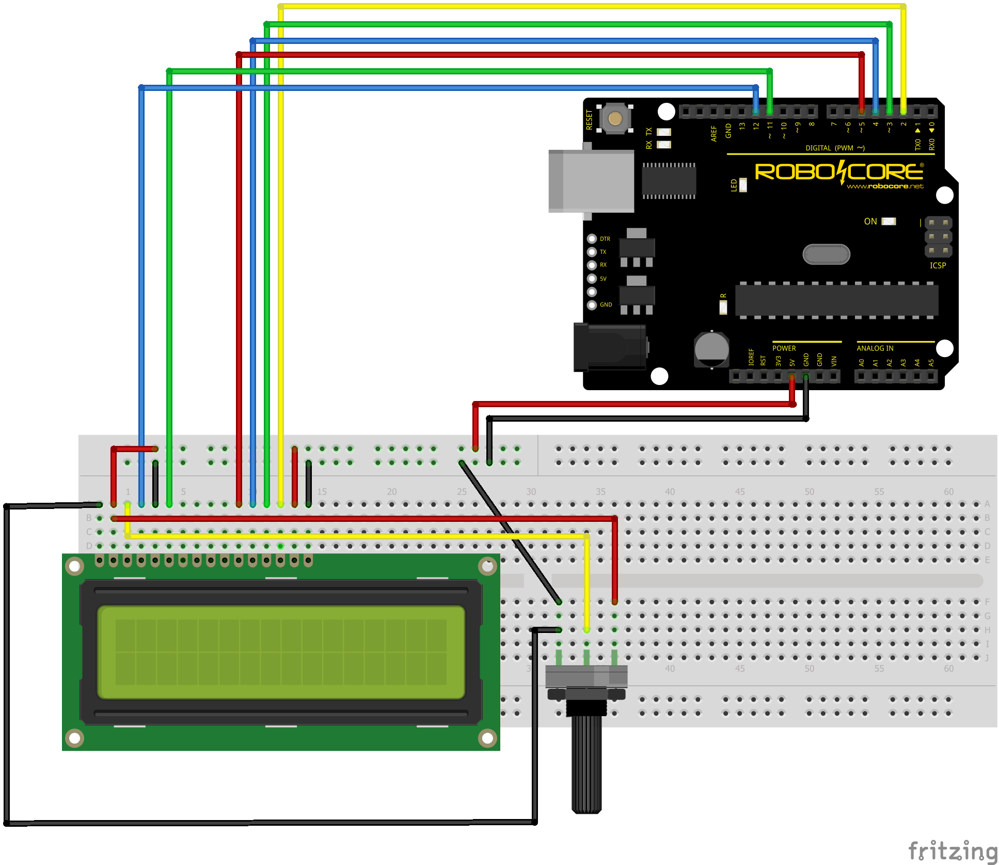

# LCD

Nesta aula veremos como utilizar o display LCD.

Os displays LCD utilizados com o Arduino normalmente são baseados no chipset Hitachi HD44780, e é nos protocolos de comunicação que este chipset utiliza que a bibilioteca [LiquidCrystal](https://www.arduino.cc/en/Reference/LiquidCrystal) se baseia.

O display em nosso kit possui duas linhas de 16 caracteres, e precisam de pelo menos 8 pinos do Arduino para seu funcionamento, 6 pinos digitais, 1 5V e 1 GND.

## Cenário proposto

- Utilizar o display LCd em um Sketch Arduino.
- Utilizar a biblioteca [LiquidCrystal](https://www.arduino.cc/en/Reference/LiquidCrystal) para manipular o componente

Executar os seguintes exercícios:

### Básico
- Conectar corretamente o componente LCD
- Exibir uma mensagem de texto estática na primeira linha do display
- Exibir uma mensagem contendo o número de segundos passado desde o início da execução do programa na segunda linha do display

### Exibir distância
- Conectar um sensor [Ultrassom](./07-ultrassom.md)
- Exibir "Distancia em cm:" na primeira linha do display
- Exibir no display LCD a distância medida pelo sensor ultrassom na segunda linha do display

## Desenho

### Protoboard

## Código
- [Básico](../exercicios/08-lcd/01-basico/lcd.ino)
- [Exibir distância](../exercicios/08-lcd/02-escrever-distancia/escrever-distancia.ino)
